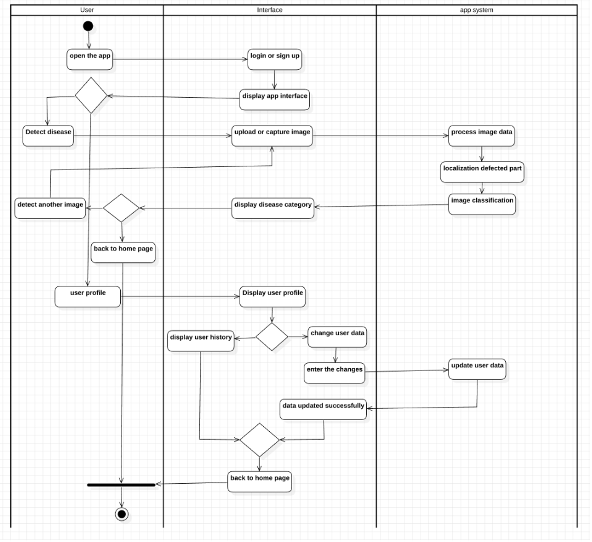

# 🥔 Potato Leaf Disease Detector

A cross-platform AI-powered mobile app that helps farmers detect and manage potato leaf diseases using deep learning.

## 📱 About the Project

Potatoes are vulnerable to several diseases which, if not caught early, can reduce yields and hurt farmers financially. This project presents a deep learning–based mobile application that detects five potato leaf conditions (Alternaria Solani, Insect Damage, Phytophthora Infestans, Virus, and Healthy) using:
- ResNet for classification
- Grad-CAM for infected area localization
- Flutter for the mobile app
- Firebase + Supabase for cloud integration
- Flask API for ML inference & report generation

## 🚀 Features
- 🌱 Capture or upload potato leaf images
- 🔍 Classify the disease type using ResNet
- 🔥 Highlight affected regions using Grad-CAM
- 📄 Generate detailed PDF reports
- ☁️ Store and retrieve analysis history using Supabase
- 🔐 User authentication with Firebase
- 📱 Fully functional offline mode

## 🧠 AI Models Used

| Task | Model | Framework | Notes |
|------|-------|-----------|-------|
| Disease Classification | Modified ResNet-50 | TensorFlow | Trained using transfer learning and fine-tuning |
| Localization | Grad-CAM | TensorFlow | Used instead of U-Net due to lack of masks |

## 🗂️ Dataset & Preprocessing
- Sources: PlantVillage & local farms
- Categories: Alternaria Solani, Phytophthora Infestans, Insect, Virus, Healthy
- Steps:
  - Image resizing to 256×256
  - Normalization [0, 1]
  - Augmentation (x5 per image)

## 🧪 Testing Overview

| Layer | Tools/Methods |
|-------|---------------|
| Model Testing | Confusion matrix, fine-tuning |
| API Testing | Postman + Flask error handling |
| Load Testing | locust.io stress testing |
| App Testing | Unit testing, UAT with farmers |

## 🧱 System Architecture

- Flutter App → Captures/Uploads image
- Flask API → Classifies disease, generates Grad-CAM + report
- Supabase → Stores profile, reports, history
- Firebase Auth → Manages secure user login

## 🧑‍💻 Technologies Used

| Layer | Stack |
|-------|-------|
| Frontend | Flutter (Dart) |
| Backend | Flask (Python) + TensorFlow |
| Auth | Firebase Authentication |
| Cloud Storage | Supabase (PostgreSQL + Storage) |
| Model Training | Jupyter, Keras, Python, OpenCV |
| Tools | StarUML, Visual Paradigm, Android Studio |

## 📊 Project Diagrams

### 🔄 User Flow (Activity Diagram)

The activity diagram shows the complete user flow from login to report generation:



[View full Activity Diagram](assets/activity.png)

### 👤 Use Case Diagram

This diagram illustrates all possible interactions between users and the system:


[View full Use Case Diagram](assets/usecase.png)

### 📐 Class Diagram

The class diagram shows the object-oriented structure of the application:


[View full Class Diagram](assets/class.png)

### ⏱️ Sequence Diagram

This diagram demonstrates the sequence of interactions for disease detection:


[View full Sequence Diagram](assets/sequence.png)

### 🏗️ Component Diagram

Shows the main components and their interconnections:


[View full Component Diagram](assets/systemarchitecture.png)

## 📅 Project Timeline

Check out the Gantt Chart for all 51 project tasks across 2024–2025:


[View full Gantt Chart](assets/GantChart.png)


## 📈 Agile Development Sprints

| Sprint Range | Focus |
|--------------|-------|
| Sprint 1-2 | Environment setup, data gathering |
| Sprint 3-5 | ResNet/Grad-CAM model training |
| Sprint 6-7 | Flask API development |
| Sprint 8-10 | Flutter frontend |
| Sprint 11-12 | Auth + Supabase integration |
| Sprint 13-15 | Testing & optimization |

## 📱 App Screenshots

Here are screenshots of the application in action:

### Authentication Screens
| Sign In | Sign Up |
|---------|---------|
|  |  |

### Main Navigation
| Home Screen | Profile Page |
|-------------|-------------|
|  |  |

### Disease Classification Process
| Classification Page | Classification Results |
|---------------------|------------------------|
|  |  |

### Disease Detection Examples
| Alternaria Solani | Phytophthora Infestans | Insect Damage | Virus Disease |
|-------------------|------------------------|---------------|---------------|
|  |  |  |  |

### Report Generation
| Report Creation | About Screen |
|-----------------|-------------|
|  |  |

[View all screenshots](/assets)

## 📦 Installation & Running Locally

### Download Full App Package
For convenience, you can download the complete application package (including all source code, models, and documentation) from:

[📥 Download Full App Package (Google Drive)](https://drive.google.com/file/d/1QtigCiRq_Tib5ddvCstc6l-Sk-1BIBEy/view?usp=sharing)

### Backend (Flask)

```bash
git clone https://github.com/ziadhenedy/potato-disease-backend.git
cd backend
pip install -r requirements.txt
python app.py
```

### Flutter App

```bash
git clone https://github.com/ziadhenedy/potato-disease-detector.git
cd app
flutter pub get
flutter run
```

Configure supabaseUrl, anonKey, and Firebase in `/lib/core/config.dart`

## 📎 Future Enhancements
- Add more crop types (tomato, cucumber)
- Real-time disease tracking dashboard
- Arabic localization
- Offline model support (TensorFlow Lite)

## 📖 License

This project is licensed under the MIT License.

## 🙏 Acknowledgements

Special thanks to Dr. Ramadan Babers for invaluable guidance, and to my family's potato farm for inspiring this real-world AI solution.
